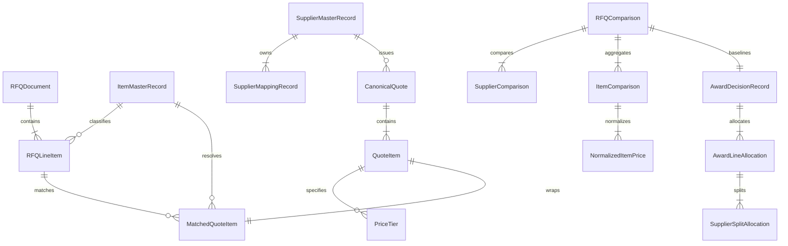
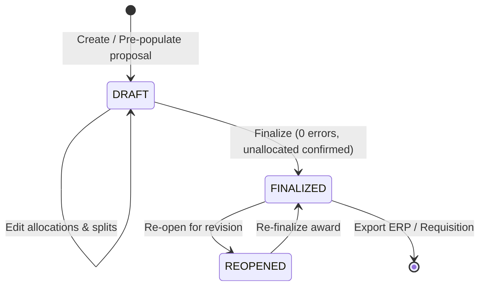

# Canonical Procurement Domain Contracts
**Quote Intelligence — Architectural Specification & Domain Contracts**
**Version:** 1.0.0 (Canonical Baseline)  
**Status:** Approved Architectural Contract  
**Authoritative Scope:** Entire Procurement Intelligence Platform

---

## 1. Executive Summary & Architectural Philosophy

Quote Intelligence is an enterprise multi-stage procurement intelligence platform spanning RFQ ingestion, Item/Supplier Master synchronization, quotation parsing, multi-signal matching, commercial normalization, scenario comparison, multi-supplier split allocation, award finalization, and ERP execution exports.

As the platform has matured, distinct calculation paths and semantic models have appeared across backend services, route handlers, Jinja templates, and client-side JavaScript. This document establishes the **authoritative canonical domain contracts** for the platform.

### The Core Architectural Principle
```
      ┌─────────────────────────────────────────────────────────┐
      │                  ONE BUSINESS CONCEPT                   │
      │                            ▼                            │
      │                ONE CANONICAL CONTRACT                   │
      │                            ▼                            │
      │              ONE AUTHORITATIVE CALCULATION              │
      │                            ▼                            │
      │                MANY UI REPRESENTATIONS                  │
      └─────────────────────────────────────────────────────────┘
```

### Absolute System Invariants
1. **Semantic Quantity Distinction**:
   - `RFQ_REQUIRED_QTY` $\neq$ `SUPPLIER_QUOTED_QTY` $\neq$ `AWARDED_QTY` $\neq$ `REMAINING_QTY` $\neq$ `SHORTFALL_QTY` $\neq$ `EXCESS_QTY` $\neq$ `UNUSED_QUOTE_QTY`.
   - Quantities must never be conflated, aliased, or silently interchanged.
2. **Zero Data Fabrication**:
   - The system must **NEVER** fabricate values such as `100`, `1`, `1.0`, or `PCS` when procurement data is missing.
   - Missing data must remain `None` / `null` / `N/A` and be explicitly surfaced to the buyer as missing state.
3. **Permanent Historical Records**:
   - User-created RFQs, historical quotes, comparisons, and finalized awards are permanent audit records. They must never be deleted by background tasks or automated resets.
4. **Master Data Dependency Protection**:
   - Item Master and Supplier Master records cannot be deleted if active RFQs, quotes, mappings, or awards reference them. Soft-deactivation is enforced.
5. **Hard Conflict Overrides**:
   - Hard attribute mismatches (critical dimensions, voltage, material, UOM incompatibility) strictly override high text/fuzzy similarity scores.
6. **Dimension-Safe UOM Conversions**:
   - UOM conversions are restricted to approved intra-dimension rates unless explicit Item Master packaging conversion factors are registered. Unapproved cross-dimension conversions trigger `UOM_INCOMPATIBLE` and block allocation.
7. **Backend Calculation Authority**:
   - Backend domain services are the single source of truth for all business calculations. Frontend templates and scripts must consume authoritative view models and must not establish competing business logic.

---

## 2. Entity Relationship Model & System Domains



---

## 3. Canonical Terminology & Glossary

| Canonical Term | Definition | Forbidden Aliases / Anti-patterns |
|---|---|---|
| **RFQ** | Request For Quotation; buyer requirements envelope | "Tender", "Project", "Job" |
| **RFQ Requirement Line** | Individual line item requested by buyer with requirement quantity and target UOM | "RFQ Item", "Requirement Spec", "Part" |
| **Supplier Master** | Authoritative corporate registry of approved vendors | "Vendor Master", "Contact List" |
| **Supplier Quote** | Ingested supplier quotation document associated with an RFQ | "Bid", "Proposal", "Offer" |
| **Supplier Quote Line** | Extracted line item from supplier quote with quoted capacity and unit pricing | "Quote Row", "Supplier Line" |
| **Item Master** | Centralized catalog of standard parts, internal SKUs, and approved conversion factors | "Part Master", "ERP Catalog", "Material Master" |
| **Match Candidate** | Potential association between Quote Line and RFQ Line or Item Master | "Match Result", "Link Candidate" |
| **Decision Band** | Confidence categorization: `HIGH_CONFIDENCE`, `BULK_CANDIDATE`, `MANUAL_REVIEW`, `LOW_CONFIDENCE`, `BLOCKED_CONFLICT` | "Match Tier", "Confidence Level" |
| **Commercial Normalization**| Currency, tax, discount, charges, and UOM harmonization into comparable base currency price | "Price Equalization", "Clean Price" |
| **Landed Unit Price** | All-inclusive cost per unit in base currency (Base + Net Tax + Allocated Charges $\times$ FX) | "Effective Price", "Net-Net Unit Cost" |
| **Award Allocation** | Decision distributing an RFQ Line's required quantity across one or more suppliers | "Split Order", "Award Line", "Award Sourcing" |
| **Award Decision** | Finalized procurement commitment record locking allocations to a comparison baseline | "Final Award", "Purchase Commitment" |

---

## 4. Quantity Semantics Contract

Every quantity displayed, calculated, or stored in the system MUST map directly to one of these explicit semantic quantity contracts:

```
                  ┌─────────────────────────────────────┐
                  │          RFQ_REQUIRED_QTY           │
                  └──────────────────┬──────────────────┘
                                     │
           ┌─────────────────────────┴─────────────────────────┐
           ▼                                                   ▼
┌─────────────────────┐                             ┌─────────────────────┐
│ SUPPLIER_QUOTED_QTY │                             │     AWARDED_QTY     │
└──────────┬──────────┘                             └──────────┬──────────┘
           │                                                   │
           │                                ┌──────────────────┴──────────────────┐
           ▼                                ▼                                     ▼
┌─────────────────────┐          ┌─────────────────────┐               ┌─────────────────────┐
│  UNUSED_QUOTE_QTY   │          │    REMAINING_QTY    │               │     EXCESS_QTY      │
│  (Quoted - Awarded) │          │(max(Req - Award, 0))│               │(max(Award - Req, 0))│
└─────────────────────┘          └─────────────────────┘               └─────────────────────┘
```

### Detailed Quantity Specification

| Semantic Quantity Type | Definition | Source Authority | Mutability | Derivation / Formula | Missing Value Rule |
|---|---|---|---|---|---|
| `RFQ_REQUIRED_QTY` | Quantity requested by buyer in RFQ line | RFQ Document extraction / Buyer input | Immutable once RFQ opened | Primary Source Field | Must remain `None` (Never default to 1, 100, PCS) |
| `SUPPLIER_QUOTED_QTY` | Capacity quoted by supplier for quote line | Supplier Quote document extraction | Correctable via `FieldCorrection` | Primary Source Field | Must remain `None` (Never default to RFQ qty) |
| `AWARDED_QTY` | Quantity allocated to a specific supplier for an RFQ line | Buyer award decision / Safe allocation rule | Mutable in `DRAFT`/`REOPENED` award; Immutable in `FINALIZED` | $\min(\text{RFQ\_REQUIRED\_QTY}, \text{SUPPLIER\_QUOTED\_QTY})$ (default proposal) | Default `Decimal("0")` if unallocated |
| `REMAINING_QTY` | Unallocated requirement quantity still needed to fulfill RFQ line | Award Calculation Service | Derived | $\max(\text{RFQ\_REQUIRED\_QTY} - \sum \text{AWARDED\_QTY}, 0)$ | `None` if `RFQ_REQUIRED_QTY` is `None` |
| `SHORTFALL_QTY` | Synonym for unfulfilled requirement quantity | Award Calculation Service | Derived | $\max(\text{RFQ\_REQUIRED\_QTY} - \sum \text{AWARDED\_QTY}, 0)$ | `None` if `RFQ_REQUIRED_QTY` is `None` |
| `EXCESS_QTY` | Over-allocated quantity beyond buyer requirement | Award Validation Service | Derived | $\max(\sum \text{AWARDED\_QTY} - \text{RFQ\_REQUIRED\_QTY}, 0)$ | `Decimal("0")` if $\le$ requirement |
| `UNUSED_QUOTE_QTY` | Quoted supplier capacity left unawarded | Award Calculation Service | Derived | $\max(\text{SUPPLIER\_QUOTED\_QTY} - \text{AWARDED\_QTY}, 0)$ | `None` if `SUPPLIER_QUOTED_QTY` is `None` |

---

## 5. UOM Semantics & Dimension Safety Matrix

### UOM Resolution Rules
1. **Case-Insensitive Normalization**: UOM strings are normalized to uppercase stripped tokens (e.g. `pcs`, `PCS `, `Pcs` $\rightarrow$ `PCS`).
2. **Dimension Table**: Standard physical dimensions support exact intra-dimension conversions:
   - **LENGTH**: Base = `MTR` (`MTR`: 1.0, `FT`: 0.3048, `MM`: 0.001, `CM`: 0.01, `INCH`: 0.0254, `YARD`: 0.9144).
   - **WEIGHT**: Base = `KG` (`KG`: 1.0, `G`: 0.001, `TON`: 1000.0, `LBS`: 0.453592).
   - **VOLUME**: Base = `LTR` (`LTR`: 1.0, `ML`: 0.001, `CUM`/`M3`: 1000.0).
   - **COUNT**: Base = `PCS` (`PCS`: 1.0, `NOS`: 1.0, `UNIT`: 1.0, `EA`: 1.0, `PAIR`: 2.0, `DOZEN`: 12.0).
   - **TIME_SERVICE**: `HOUR`, `DAY`, `MONTH`, `YEAR`, `SERVICE`, `LOT`, `JOB`.
   - **DIGITAL_LICENSE**: `LICENSE`, `USER`, `SEAT`, `NODE`, `DEVICE`, `SUBSCRIPTION`.
3. **Cross-Dimension Prevention**:
   - Cross-dimension conversions (e.g. `BOX` $\rightarrow$ `PCS`, `KG` $\rightarrow$ `MTR`, `ROLL` $\rightarrow$ `MTR`) are **STRICTLY FORBIDDEN** unless an explicit packaging conversion factor is registered on the `ItemMasterRecord` or `RFQLineItem.approved_uom_conversions`.
   - If no approved factor exists:
     - `is_compatible = False`
     - `conversion_method = "INCOMPATIBLE"`
     - Status set to `UOM_INCOMPATIBLE`
     - Commercial comparison and award allocation are **BLOCKED**.

---

## 6. Matching & Review Semantics

### Decision Bands
The matching engine evaluates multi-signal evidence (Supplier Part Number exact match, Manufacturer Part Number exact match, Internal SKU match, Description Token Cosine/Jaccard, Specification delta, UOM compatibility, and Historical Learning Memory) into 5 canonical decision bands:

```
 100% ┌──────────────────────────────────────────────────────────┐
      │ HIGH_CONFIDENCE (Score >= 95%)                           │
      │ -> Automatically resolved (zero human intervention)      │
  95% ├──────────────────────────────────────────────────────────┤
      │ BULK_CANDIDATE (Score 80% - 94%)                         │
      │ -> System-generated batches (2-step bulk confirmation)   │
  80% ├──────────────────────────────────────────────────────────┤
      │ MANUAL_REVIEW (Score 50% - 79%)                          │
      │ -> Guided individual candidate review                    │
  50% ├──────────────────────────────────────────────────────────┤
      │ LOW_CONFIDENCE (Score < 50%)                             │
      │ -> Individual manual lookup / search in master catalog   │
   0% └──────────────────────────────────────────────────────────┘
      [OVERRIDE: Hard Conflict / Mismatch -> BLOCKED_CONFLICT]
```

### Review State Model
Every quotation line item in the context of an RFQ maps to one of 5 review states:
1. `AUTO_RESOLVED`: High confidence ($\ge 95\%$) or human-confirmed match.
2. `BULK_CANDIDATE`: High quality candidate ($80\% - 94\%$) grouped into system-generated batches.
3. `MANUAL_REVIEW`: Ambiguous candidate ($50\% - 79\%$) requiring buyer inspection.
4. `BLOCKED_CONFLICT`: Hard attribute conflict detected (overrides score).
5. `UNMATCHED`: No candidate found above minimum threshold ($< 50\%$).

---

## 7. Commercial Normalization Semantics

### Landed Price Calculation Pipeline
For each RFQ Line Item $i$ and Supplier Quote Item $j$:
1. **Quantity Conversion**:
   $$\text{RFQ\_QTY\_IN\_QUOTED\_UOM} = \frac{\text{RFQ\_REQUIRED\_QTY}}{\text{uom\_conversion\_factor}}$$
2. **Effective Unit Price Resolution**:
   $$\text{unit\_price\_quoted} = \text{resolve\_tier\_price}(\text{price\_tiers}, \text{RFQ\_QTY\_IN\_QUOTED\_UOM}) \lor \text{quote\_item.unit\_price}$$
3. **Net Unit Price**:
   $$\text{net\_unit\_price\_quoted} = \text{unit\_price\_quoted} \times \left(1 - \frac{\text{discount\_pct}}{100}\right)$$
4. **Per-Unit Tax Component**:
   $$\text{tax\_per\_unit\_quoted} = \text{net\_unit\_price\_quoted} \times \left(\frac{\text{tax\_rate\_pct}}{100}\right)$$
5. **Allocated Freight / Additional Charges**:
   - If `PROPORTIONAL_LINE_VALUE`:
     $$\text{allocated\_charge\_line} = \text{total\_charges\_quoted} \times \left(\frac{\text{line\_taxable\_amount}}{\text{total\_quote\_taxable\_amount}}\right)$$
     $$\text{allocated\_charge\_per\_unit} = \frac{\text{allocated\_charge\_line}}{\text{RFQ\_REQUIRED\_QTY}}$$
6. **Landed Unit Price (Base Currency)**:
   $$\text{unit\_landed\_price\_base} = (\text{net\_unit\_price\_quoted} + \text{tax\_per\_unit\_quoted} + \text{allocated\_charge\_per\_unit}) \times \text{exchange\_rate\_to\_base}$$
7. **Line Total Commitment**:
   $$\text{line\_total\_landed\_base} = \text{quantize\_currency}(\text{AWARDED\_QTY} \times \text{unit\_landed\_price\_base})$$

---

## 8. Allocation & Split Sourcing Semantics

### Safe Allocation Invariant
- **Ceiling 1 (Supplier Capacity)**: $\text{AWARDED\_QTY}_{i, s} \le \text{SUPPLIER\_QUOTED\_QTY}_{i, s}$
- **Ceiling 2 (RFQ Requirement)**: $\sum_{s} \text{AWARDED\_QTY}_{i, s} \le \text{RFQ\_REQUIRED\_QTY}_{i}$
- **Split Sourcing**: An RFQ line can be divided among multiple eligible suppliers, provided:
  $$\sum_{s=1}^{k} \text{AWARDED\_QTY}_{i, s} = \text{RFQ\_REQUIRED\_QTY}_{i}$$

### Line Allocation States
- `FULLY_ALLOCATED`: $\sum \text{AWARDED\_QTY} = \text{RFQ\_REQUIRED\_QTY}$ ($\text{RFQ\_REQUIRED\_QTY} > 0$)
- `PARTIALLY_ALLOCATED`: $0 < \sum \text{AWARDED\_QTY} < \text{RFQ\_REQUIRED\_QTY}$
- `UNALLOCATED`: $\sum \text{AWARDED\_QTY} = 0$
- `OVER_ALLOCATED`: $\sum \text{AWARDED\_QTY} > \text{RFQ\_REQUIRED\_QTY}$ (BLOCKS finalization)
- `MISSING_REQUIRED_QTY`: RFQ line missing required quantity
- `MISSING_SUPPLIER_QTY`: Quote line missing quoted quantity
- `UOM_INCOMPATIBLE`: UOM mismatch without conversion factor (BLOCKS finalization)
- `NOT_QUOTED`: No comparable supplier bid available

---

## 9. Award Lifecycle & Finalization Semantics



### Finalization Validation Rules
1. **Zero Validation Errors**: Must have zero over-allocations, zero capacity violations, and zero incompatible UOMs.
2. **Partial Award Confirmation**: If any line item is `PARTIALLY_ALLOCATED` or `UNALLOCATED`, finalization is blocked unless `buyer_accepted_unallocated == True`.
3. **Immutability of Finalized Awards**: Once `status == "FINALIZED"`, allocations are locked to the specific `comparison_id`. Any edits require calling `reopen_award_decision()`.

---

## 10. Audit, Provenance & Human Override Semantics

### Cell-Level Provenance
Every extracted document field and quote line item carries a `Provenance` coordinate:
- `source_file_name`, `source_file_hash`, `page_number`, `sheet_name`, `row_idx`, `col_idx`, `cell_ref`, `source_text`, `bbox`.

### Field-Level Human Override Precision
When a human corrects an extracted value (e.g. changing price or UOM):
- The override is stored in `field_corrections[field_name] = FieldCorrection(...)`.
- `merge_reextraction()` ensures that subsequent AI re-extractions update all untouched fields while strictly preserving human-locked fields.

---

## 11. Calculation Authority Map

The following map defines the single authoritative service for every calculation in the system:

| Business Calculation | Current Scattered Locations | Current Authority | Duplicate Implementations | Canonical Authoritative Service |
|---|---|---|---|---|
| **Remaining / Shortfall Qty** | `app/services.py`, `app/templates/award/decision.html`, `award/exporter.py` | `app/services.py` | Javascript `recalculateTotals()`, Exporter scripts | `app.services.calculate_line_fulfillment()` / `award.services` |
| **Fulfillment Percentage** | `app/services.py`, `app/templates/award/decision.html` | `app/services.py` | Javascript string formatting, services duplicate math | `app.services.calculate_line_fulfillment()` |
| **Award Value** | `app/services.py`, `award/exporter.py`, `app/templates/award/decision.html` | `app/services.py` | JS client calculation, exporter recalculation | `app.services.calculate_award_value()` |
| **Landed Unit Price** | `core/canonical_quote.py`, `comparison/normalizer.py`, `app/services.py` | `comparison/normalizer.py` | `QuoteItem.calculate_line_landed_cost()`, Services dict mapper | `comparison.normalizer.CommercialNormalizer` |
| **UOM Conversion Factor** | `matching/uom_resolver.py`, `comparison/normalizer.py`, `extraction/financial_engine.py` | `matching/uom_resolver.py` | Local string parser fallbacks in extraction | `matching.uom_resolver.UOMResolver` |
| **Supplier Capacity Ceiling** | `app/services.py`, `app/templates/award/decision.html` | `app/services.py` | JS input validator, services proposal builder | `app.services.validate_award_allocation()` |
| **Supplier RFQ Coverage** | `app/services.py`, `comparison/ranking.py` | `comparison/ranking.py` | `format_coverage_pct()`, `get_quotes_for_rfq()` | `comparison.ranking.RankingEngine` |
| **Matching Score & Band** | `matching/matcher.py`, `app/services.py` | `matching/matcher.py` | `classify_matched_item_review_state()` re-evaluates | `matching.matcher.Matcher` |

---

## 12. Identified Contradictions & Duplications

1. **Contradiction 1: `MatchStatus` Enum Divergence**:
   - `core/canonical_quote.py` defines `MatchStatus` as (`AUTO_MATCHED`, `FUZZY_MATCHED`, `MANUAL_MATCHED`, `UNMATCHED`, `IGNORED`).
   - `matching/models.py` defines `MatchStatus` as (`EXACT_MATCH`, `HIGH_CONFIDENCE_MATCH`, `REVIEW_REQUIRED`, `UNMATCHED`, `UOM_INCOMPATIBLE`).
   - *Resolution*: Adopt `matching/models.py: DecisionBand` and `MatchStatus` as the canonical standard.
2. **Contradiction 2: Quantity Property Name Variations**:
   - `requested_quantity` in `RFQLineItem` vs `requested_qty` in `NormalizedItemPrice` vs `required_qty` in `AwardLineAllocation` vs `req_qty` in local helper variables.
   - *Resolution*: Maintain typed model properties with canonical accessor properties.
3. **Contradiction 3: Landed Cost Calculation Duplication**:
   - `QuoteItem.calculate_line_landed_cost()` in `core/canonical_quote.py` performs simple tax summation without currency conversion or charge allocation.
   - `CommercialNormalizer.normalize_item_price()` in `comparison/normalizer.py` performs full commercial normalization.
   - *Resolution*: `CommercialNormalizer` is the sole authoritative engine for landed cost calculations.
4. **Contradiction 4: Client-side Calculations in Templates**:
   - `decision.html` contained client-side JavaScript that independently calculated remaining quantities and line totals.
   - *Resolution*: Client JS only performs immediate interactive UI mirroring; all submission payloads are sanitized, validated, and recomputed deterministically on the backend.

---

## 13. Cross-Domain Invariant Verification Checklist

- [x] Absolute Quantity Semantics strictly segregated across models.
- [x] Zero fabrication of quantities or UOMs (preserving `None` for missing data).
- [x] Dimension-safe UOM conversion with hard incompatibility blocking.
- [x] Hard matching conflicts override numeric similarity scores.
- [x] Immutability of finalized awards locked to comparison baselines.
- [x] Item Master and Supplier Master deletion protected by dependency checks.
- [x] Re-extraction merges AI outputs while preserving granular human overrides.
- [x] Single canonical calculation authority for landed costs, award values, and fulfillment states.
