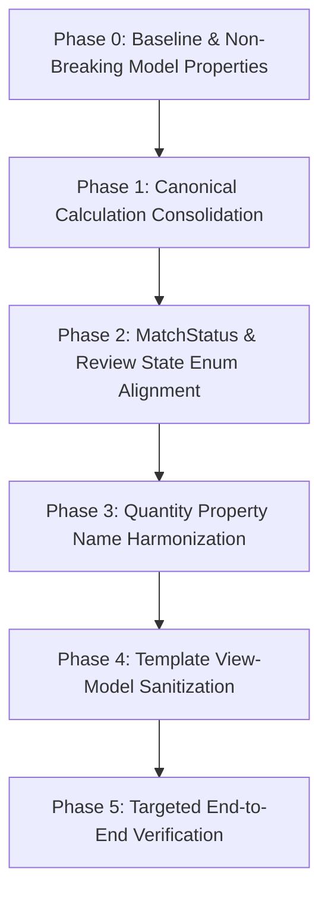

# Domain Contract Migration Plan
**Quote Intelligence — Safe Phased Execution Blueprint**
**Version:** 1.0.0  
**Status:** Approved for Implementation (Awaiting User Directive)

---

## 1. Objective & Non-Negotiable Boundaries

This migration plan outlines the structured, risk-free technical sequence to align the Quote Intelligence codebase with the [Canonical Domain Contracts](file:///C:/Users/ABHIMANYU%20KUMAR/.gemini/antigravity/scratch/quote_intelligence/docs/architecture/canonical-domain-contracts.md).

### Non-Negotiable Rules
- **DO NOT** rewrite working features or the persistence layer in one monolithic step.
- **DO NOT** delete user data, historical awards, quotations, or catalog records.
- **DO NOT** create parallel, competing matching or comparison pipelines.
- **DO NOT** run large synthetic test suites; execute targeted single-scenario tests at each phase boundary.

---

## 2. Phased Migration Sequence

---

### Phase 0: Non-Breaking Contract Aliasing & Safety Nets
**Goal**: Introduce canonical accessors and properties on existing domain models without modifying existing database files or breaking existing callers.

1. **Model Property Aliasing**:
   - Add property getters/setters on `RFQLineItem`, `NormalizedItemPrice`, `QuoteItem`, and `AwardLineAllocation` to support both `requested_quantity` $\leftrightarrow$ `requested_qty` $\leftrightarrow$ `required_qty`.
   - Ensure `Optional[Decimal]` semantics are preserved across all quantity models.
2. **Persistence Compatibility**:
   - Ensure serialization to/from JSON accepts legacy keys seamlessly.

---

### Phase 1: Canonical Calculation Service Consolidation
**Goal**: Eliminate duplicate mathematical implementations and establish single-service authority.

1. **Consolidate Landed Cost Calculations**:
   - Make `comparison.normalizer.CommercialNormalizer` the sole engine for unit landed prices and volume tier resolution.
   - Deprecate raw `QuoteItem.calculate_line_landed_cost()` in favor of normalizer output.
2. **Consolidate Quantity & Fulfillment Derivations**:
   - Create centralized pure helper functions in `award.services` / `app.services`:
     - `calculate_line_fulfillment(req_qty, splits) -> LineFulfillmentResult`
     - `calculate_award_value(awarded_qty, unit_landed_cost) -> Decimal`
3. **Consolidate Supplier Coverage**:
   - Direct all coverage math in `app/services.py` to `comparison.ranking.RankingEngine`.

---

### Phase 2: MatchStatus, Review State & Decision Band Alignment
**Goal**: Unify overlapping matching and review enums.

1. **Adopt Canonical `DecisionBand` and `MatchStatus`**:
   - Standardize `core/canonical_quote.py: MatchStatus` to align with `matching/models.py: DecisionBand`.
   - Update `app/services.py: classify_matched_item_review_state()` to strictly output canonical states (`AUTO_RESOLVED`, `BULK_CANDIDATE`, `MANUAL_REVIEW`, `BLOCKED_CONFLICT`, `UNMATCHED`).
2. **Preserve Legacy Enum Support**:
   - Support reading legacy match state strings from disk without errors.

---

### Phase 3: Quantity Attribute Name Harmonization
**Goal**: Align all internal variable and dictionary names to canonical quantity contracts.

1. **Enforce Semantic Constants**:
   - Use `RFQ_REQUIRED_QTY`, `SUPPLIER_QUOTED_QTY`, `AWARDED_QTY`, `REMAINING_QTY`, `SHORTFALL_QTY`, `UNUSED_QUOTE_QTY` across all proposal builders, validators, and exporters.
2. **Clean Up Local Helper Variables**:
   - Refactor ambiguous `qty` or `item_qty` variable names in `app/services.py` and `award/exporter.py` to explicit semantic variables (`req_qty`, `quoted_qty`, `awarded_qty`).

---

### Phase 4: Template & View-Model Harmonization
**Goal**: Ensure frontend templates strictly consume authoritative backend view models.

1. **View Model Sanitization**:
   - Pass pre-calculated, formatted strings and calculation breakdowns directly in template context.
2. **Jinja & JavaScript Boundary**:
   - Ensure client-side JavaScript in `decision.html` and `review/index.html` operates purely as an immediate visual mirror; all finalization requests submit raw user allocations which the backend re-validates and recomputes.

---

### Phase 5: Targeted End-to-End Verification
**Goal**: Validate full lifecycle across real RFQ without regressions.

1. Verify RFQ Creation from requirements document.
2. Verify Quote Ingestion, Extraction, and Matching.
3. Verify Commercial Evaluation & Normalization.
4. Verify Award Allocation & Finalization (Scenarios A through M).
5. Verify Excel, PDF, and CSV exports.

---

## 3. Risk Matrix & Mitigations

| Risk | Severity | Probability | Mitigation Strategy |
|---|---|---|---|
| **JSON Schema Incompatibility** with existing saved RFQs/Awards | HIGH | LOW | Implement backward-compatible Pydantic field validators and alias mappers. |
| **Breaking Client-Side Recalculations** in Jinja templates | MEDIUM | LOW | Keep HTML `data-*` attribute names synchronized and test live DOM events. |
| **Floating-point Drift** during currency/tax calculations | HIGH | LOW | Enforce strict `Decimal` and `quantize_currency` across all calculation boundaries. |
| **Silent Over-Allocation** on split-sourcing edge cases | HIGH | LOW | Retain server-side hard blocking validation safeguards. |

---

## 4. Recommended Next Step

Wait for user review and explicit approval of the Canonical Domain Contracts and Migration Plan before initiating Phase 0 execution.
